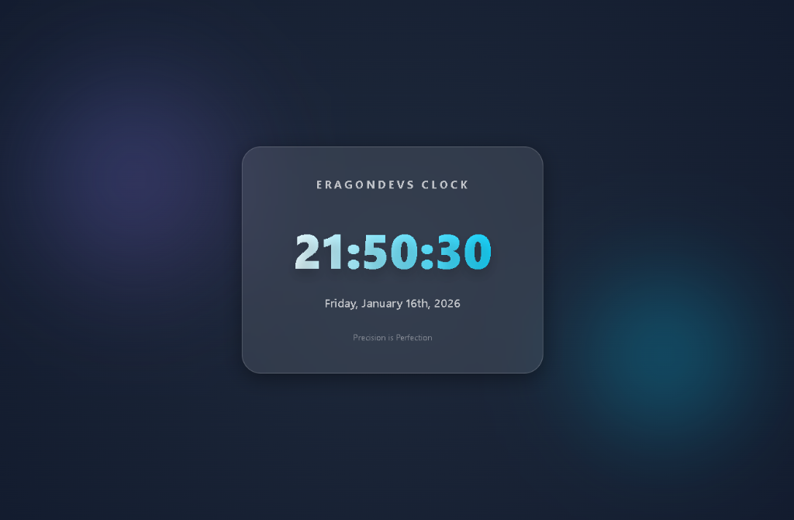
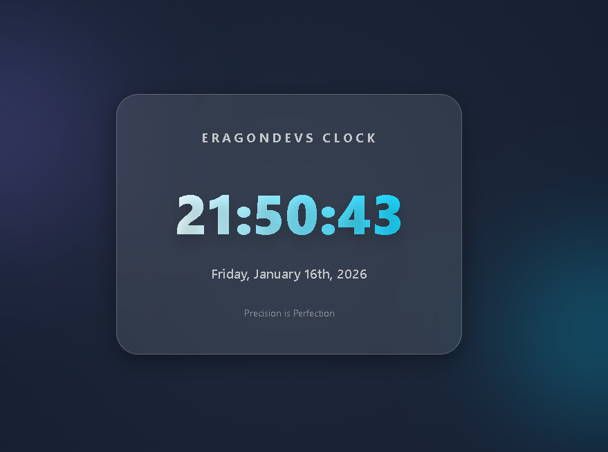

# Eragondevs Dynamic Color Clock

## Overview
Eragondevs Dynamic Color Clock is a premium, visually stunning digital clock widget built with React and powered by `date-fns`. It features a sleek glassmorphism design with vibrant gradients and real-time updates, designed to fit perfectly into any high-end productivity dashboard.

## Features
- **Real-time Digital Clock**: Updates every second with precise time.
- **Dynamic Date Display**: Shows the current date in a readable, elegant format.
- **Premium Aesthetics**: A glassmorphism-inspired UI with smooth gradients and micro-animations.
- **Responsive Design**: Optimized for all screen sizes, from mobile to desktop.
- **Powered by date-fns**: Leveraging professional-grade date formatting.

## Component Documentation
### App
- **Functionality**: The central hub that manages the clock's state and life-cycle.
- **Logic**: Uses React hooks (`useState` and `useEffect`) to maintain a 1-second interval for time synchronization.
- **Dependencies**: Utilizes `date-fns` for robust date string formatting.

## Installation and Setup
1. **Clone the repository**:
   ```bash
   git clone https://github.com/wanjohialvins/clock.git
   cd clock
   ```
2. **Install dependencies**:
   ```bash
   npm install
   ```
3. **Start the development server**:
   ```bash
   npm run dev
   ```
4. **Open in browser**:
   Navigate to `http://localhost:5173`.

## Screenshots



## Developer
Developed by **Eragondevs** - Crafting precision with perfection.
